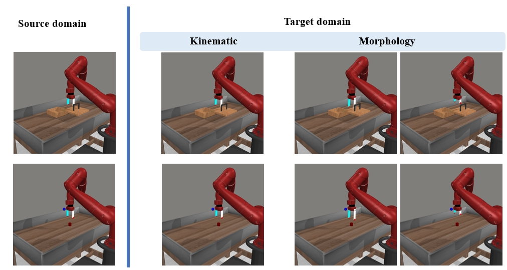

# ODRL: An Off-dynamics Reinforcement Learning Benchmark

## NEW: we support Sawyer robots and Humanoid task in this branch [Still under development!!!]



We support 5 kinds of Sawyer robot tasks under kinematic shifts and morphology shifts with shift level *easy/medium/hard* now! These tasks are adapted from the Meta-World benchmark. We limit the rotation range of all joints in the Sawyer robot to simulate broken joints, and change the size of the left and right grippers of the Sawyer robot to simulate morphology shifts. The five tasks are box, button-press, pick-place, push, hammer. One can directly use `call_sawyer_env.py` to call tasks with the Sawyer. Generally, it share a similar way of calling environments as those in the MuJoCo or Adroit domains. All Sawyer tasks have `sawyer` in their environment names. The naming rule for Sawyer robot gives `Sawyer-[task_name]-[shift_type]-[shift_part (optional)]-[shift_level]`, e.g., you can call `sawyer-pick-place-morph-gripper` task with shift level `easy` with the following codes:
```
from sawyer.call_sawyer_env import call_sawyer_env

env_config = {
    'env_name': 'sawyer-pick-place-morph-gripper',
    'shift_level': 'easy',
}

env = call_sawyer_env(env_config)

obs = env.reset()  # Reset environment
a = env.action_space.sample()  # Sample an action
obs, reward, done, info = env.step(a)
```

**YOU DO NOT NEED TO INSTALL METAWORLD TO RUN THOSE TASKS!!!** Please let us know if there are any bugs!

===============

<p align="center">
  <br />
  <a href="./LICENSE"></a>
  <a href="Python 3.8"></a>
</p>


ODRL is the first benchmark for off-dynamics RL problems, in which there is a limited budget of target domain data while comparatively sufficient source domain data can be accessed. However, there exist dynamic discrepancies between the source domain and the target domain. The goal is to acquire better performance in the target domain by leveraging data from both domains.

ODRL provides rich implementations of recent off-dynamics RL methods and also introduces some extra baselines that treat the two domains as one mixed domain. Each algorithm is implemented in a single-file and research-friendly manner, which is heavily inspired by [cleanrl](https://github.com/vwxyzjn/cleanrl) and [CORL](https://github.com/tinkoff-ai/CORL) libraries. All implemented algorithms share similar clean, easy-to-follow code styles. 

ODRL considers four varied experimental settings for off-dynamics RL, where the source domain and the target domain can be either online or offline, e.g., `Online-Online` setting indicates that both the source domain and the target domain are online, while `Online-Offline` setting means that the source domain is online while the target domain is offline.

* ✨ Single-file algorithm implementation
* ✨ Supporting various experimental settings
* ✨ Offering offline target domain datasets
* ✨ Supporting a wide spectrum of dynamics shifts

## Connections and Comparison against Other Benchmarks

ODRL is related to numerous transfer RL/multi-task RL benchmarks. We include a comparison of ODRL against some commonly used benchmarks below, including [D4RL](https://github.com/Farama-Foundation/D4RL), [DMC suite](https://github.com/google-deepmind/dm_control), [Meta-World](https://github.com/Farama-Foundation/Metaworld), [RLBench](https://github.com/stepjam/RLBench), [CARL](https://github.com/automl/CARL), [Gym-extensions](https://github.com/Breakend/gym-extensions/), [Continual World](https://github.com/awarelab/continual_world). 

| Benchmark | Offline datasets | Diverse Domains | Multi-task | Single-task Dynamics Shift |
| ----    | :---: | :---: | :---: | :---: |
| D4RL            | ✅ | ✅ | ❎ | ❎ |
| DMC suite       | ❎ | ✅ | ❎ | ❎ |
| Meta-World      | ❎ | ❎ | ✅ | ❎ |
| RLBench         | ✅ | ❎ | ✅ | ❎ |
| CARL            | ❎ | ✅ | ❎ | ✅ |
| Gym-extensions  | ❎ | ❎ | ✅ | ✅ |
| Continual World | ❎ | ❎ | ✅ | ❎ |
| **ODRL**        | ✅ | ✅ | ❎ | ✅ |

Among these benchmarks, D4RL only contains single-domain offline datasets and does not focus on the off-dynamics RL issue. DMC suite contains a wide range of tasks, but it does not offer offline datasets and does not handle the off-dynamics RL. Meta-world is designed for the multi-task RL setting. RLBench provides demonstrations for numerous tasks but it does not involve the dynamics shift in a single task. CARL focuses on the setting where the context of the environment (e.g., reward, dynamics) can change between different episodes (i.e., it does not have a *source domain* or *target domain*, but only one domain where the dynamics or rewards can change depending on the context). CARL also does not provide offline datasets. Continual world is a benchmark for continual learning in RL, and also supports multi-task learning can be used for transfer RL policies. ODRL, instead, **focuses on the setting where the agent can leverage source domain data to facilitate the policy training in the target domain, where the task in the source domain and the target domain keeps identical**.

## 🚀Getting Started

Our benchmark is *installation-free*, i.e., one does not need to run `pip install -e .`. This design choice is motivated by the fact that users may have multiple local environments which actually share numerous packages like `torch`, making it a waste of space to create another conda environment for running ODRL. Moreover, the provided packages may conflict with existing ones, posing a risk of corrupting the current environment. As a result, we do not offer a `setup.py` file. ODRL relies on some most commonly adopted packages, which should be easily satisfied: `python==3.8.13, torch==1.11.0, gym==0.18.3, dm-control==1.0.8, numpy==1.23.5, d4rl==1.1, mujoco-py==2.1.2.14`.

Nevertheless, we totally understand that some users may still need the detailed list of dependencies, and hence we also include the `requirement.txt` in ODRL. To use it, run the following commands:
```bash
conda create -n offdynamics python=3.8.13 && conda activate offdynamics
pip install setuptools==63.2.0
pip install wheel==0.38.4
pip install -r requirement.txt
```

We summarize the benchmark overview below. We provide two metrics for evaluating the performance of the agent, return and the normalized score, which gives

$NS = \dfrac{J_\pi - J_{\rm random}}{J_{\rm expert}- J_{\rm random}}\times 100,$

where $J_\pi$ is the return of the agent in the target domain, $J_{\rm expert}$ is the return of an expert policy, and $J_{\rm random}$ is the reference score of the random policy. Please check out the corresponding reference scores for the expert policy and the random policy of all tasks in `envs/infos.py`.

| Task Domain   | Friction | Gravity | Kinematic | Morphology | Map Layout | Offline Datasets |
|---------------|----------|----------|----------|----------|----------|----------|
| **Locomotion**  | ✅     |    ✅   |   ✅    |    ✅    |    ❎     |   ✅ |
| **Navigation**  | ❎     |    ❎   |  ❎      |    ❎   |    ✅   | ✅  |
| **Dexterous Manipulation**| ❎ | ❎ |   ✅   |    ✅    |    ❎     |  ✅  | 


## 🚀🚀Code Structure

* `algo` contains the implemented off-dynamics RL algorithms as well as our introduced baseline methods. These algorithms are categoried by varied experimental settings.
* `config` contains the `yaml` configuration files for each algorithm across different domains
* `envs` contains various domains and the revised `xml` files of the environments with dynamics shift.
* `dataset` is the folder where the offline target domain datasets are stored (one needs to manually download them from [here](https://drive.google.com/drive/folders/1fwkjtXCbMxVP7RM7NSN3mF40Gakwkqei?usp=sharing))
* `imgs` contains the illustration figure of this project

## 🚀🚀Experimental Settings and Implemented Algorithms 

ODRL contains the following experiemental settings: 

* **Online-Online** setting (online source domain and online target domain)
* **Offline-Online** setting (offline source domain and online target domain)
* **Online-Offline** setting (online source domain and offline target domain)
* **Offline-Offline** setting (offline source domain and offline target domain)

We implement various baseline algorithms for each setting.

| Algorithm                                                  | Variants Implemented                                   |
|------------------------------------------------------------|--------------------------------------------------------|
| **Online-Online Setting**                                  |                                                        |
| ✅ [DARC](https://openreview.net/forum?id=eqBwg3AcIAK)   | [`online_online/darc.py`](algo/online_online/darc.py)   |
| ✅ [VGDF](https://proceedings.neurips.cc/paper_files/paper/2023/file/e8ad87f1076fb0f75d89a45828f186b0-Paper-Conference.pdf)     | [`online_online/vgdf.py`](algo/online_online/vgdf.py) |
| ✅ [PAR](https://arxiv.org/pdf/2405.15369)                 | [`online_online/par.py`](algo/online_online/par.py)   |
| ✅ [SAC](https://proceedings.mlr.press/v80/haarnoja18b/haarnoja18b.pdf)     | [`online_online/sac.py`](algo/online_online/sac.py)   |
| ✅ SAC_IW                                                 | [`online_online/sac_iw.py`](algo/online_online/sac_iw.py)   |
| ✅ SAC_tune                                               | [`finetune/sac_tune.py`](algo/finetune/sac_tune.py)   |
| **Offline-Online Setting**                                  |                                                        |
| ✅ [H2O](https://proceedings.neurips.cc/paper_files/paper/2022/file/ed3cd2520148b577039adfade82a5566-Paper-Conference.pdf)   | [`offline_online/h2o.py`](algo/offline_online/h2o.py)   |
| ✅ [BC_VGDF](https://proceedings.neurips.cc/paper_files/paper/2023/file/e8ad87f1076fb0f75d89a45828f186b0-Paper-Conference.pdf)     | [`offline_online/bc_vgdf.py`](algo/offline_online/bc_vgdf.py) |
| ✅ [BC_PAR](https://arxiv.org/pdf/2405.15369)                 | [`offline_online/bc_par.py`](algo/offline_online/bc_par.py)   |
| ✅ BC_SAC                                                  | [`offline_online/bc_sac.py`](algo/offline_online/bc_sac.py)   |
| ✅ [CQL_SAC](https://proceedings.neurips.cc/paper/2020/file/0d2b2061826a5df3221116a5085a6052-Paper.pdf)    | [`offline_online/cql_sac.py`](algo/offline_online/cql_sac.py)   |
| ✅ [MCQ_SAC](https://proceedings.neurips.cc/paper_files/paper/2022/file/0b5669c3b07bb8429af19a7919376ff5-Paper-Conference.pdf)  | [`offline_online/mcq_sac.py`](algo/offline_online/mcq_sac.py)   |
| ✅ [RLPD](https://proceedings.mlr.press/v202/ball23a/ball23a.pdf)      | [`offline_online/rlpd.py`](algo/offline_online/rlpd.py)   |
| **Online-Offline Setting**                                  |                                                        |
| ✅ [H2O](https://proceedings.neurips.cc/paper_files/paper/2022/file/ed3cd2520148b577039adfade82a5566-Paper-Conference.pdf)   | [`online_offline/h2o.py`](algo/online_offline/h2o.py)   |
| ✅ [PAR_BC](https://arxiv.org/pdf/2405.15369)                 | [`online_offline/bc_par.py`](algo/online_offline/par_bc.py)   |
| ✅ SAC_BC                                                  | [`online_offline/sac_bc.py`](algo/online_offline/sac_bc.py)   |
| ✅ [SAC_CQL](https://proceedings.neurips.cc/paper/2020/file/0d2b2061826a5df3221116a5085a6052-Paper.pdf)    | [`online_offline/sac_cql.py`](algo/online_offline/sac_cql.py)   |
| ✅ [SAC_MCQ](https://proceedings.neurips.cc/paper_files/paper/2022/file/0b5669c3b07bb8429af19a7919376ff5-Paper-Conference.pdf)  | [`online_offline/sac_mcq.py`](algo/online_offline/sac_mcq.py)   |
| **Offline-Offline Setting**                                  |                                                        |
| ✅ [IQL](https://arxiv.org/pdf/2110.06169)                 | [`offline_offline/iql.py`](algo/offline_offline/iql.py)   |
| ✅ [TD3_BC](https://proceedings.neurips.cc/paper_files/paper/2021/file/a8166da05c5a094f7dc03724b41886e5-Paper.pdf)  | [`offline_offline/td3_bc.py`](algo/offline_offline/td3_bc.py)   |
| ✅ [DARA](https://arxiv.org/pdf/2203.06662)                  | [`offline_offline/dara.py`](algo/offline_offline/dara.py)   |
| ✅ [BOSA](https://arxiv.org/pdf/2306.12755)                  | [`offline_offline/bosa.py`](algo/offline_offline/bosa.py)   |

It is worth noting that when running SAC_tune, one needs to use `train_tune.py` instead of `train.py`.

## 🚀🚀🚀How to Run

We run all four experimental settings with the `train.py` file, with `mode 0` denotes the **Online-Online** setting, `mode 1` denotes the **Offline-Online** seting, `mode 2` specifies the **Online-Offline** setting, and `mode 3` means the **Offline-Offline** setting. One can switch different setting by specifying the `--mode` flag. The default value is 0, i.e., **Online-Online** setting. We give an example of how to use our benchmark below:
```bash
# online-online
CUDA_VISIBLE_DEVICES=0 python train.py --policy DARC --env hopper-kinematic-legjnt --shift_level easy --seed 1 --mode 0 --dir runs
# offline-online
CUDA_VISIBLE_DEVICES=0 python train.py --policy CQL_SAC --env ant-friction --shift_level 0.5 --srctype medium-replay --seed 1 --mode 1 --dir runs
# online-offline
CUDA_VISIBLE_DEVICES=0 python train.py --policy PAR_BC --env ant-morph-alllegs --shift_level hard --tartype expert --seed 1 --mode 2 --dir runs
# offline-offline
CUDA_VISIBLE_DEVICES=0 python train.py --policy BOSA --env walker2d-kinematic-footjnt --shift_level medium --srctype medium --tartype medium --seed 1 --mode 3 --dir runs
```
We explain some key flags below:
* `--env` specifies the name of the target domain, and the source domain will be automatically prepared
* `--shift_level` specifies the shift level for the task
* `--srctype` specifies the dataset quality of the source domain dataset
* `--tartype` specifies the dataset quality of the target domain dataset
* `--params` specifies the hyperparameter for the underlying algorithm if one wants to change the default hyperparameters, e.g., `--params '{"actor_lr": 0.003}'`

We directly adopt offline source domain datasets from the popular [D4RL](https://github.com/Farama-Foundation/D4RL) library. Please note that different dynamics shift tasks have varied shift levels. We summarize the shift levels for different tasks below.

| Task          | Supported Shift Levels |
|---------------|-----------------|
| **Locomotion friction/gravity**  | 0.1, 0.5, 2.0, 5.0 |
| **Locomotion kinematic/morphology**  | easy, medium, hard |
| **Antmaze small maze**| centerblock, empty, lshape, zshape, reverseu, reversel  | 
| **Antmaze medium/large maze**| 1, 2, 3, 4, 5, 6 | 
| **Dexterous Manipulation**| easy, medium, hard |

## Licences

Our repository is licensed under the MIT licence. The adopted Gym environments and mujoco-py are also licensed under the MIT License. For the D4RL library (including the Antmaze domain and the Adroit domain, and offline datasets), all datasets are licensed under the Creative Commons Attribution 4.0 License (CC BY), and code is licensed under the Apache 2.0 License.

## TODO

We plan to support more real-world robotic environments and include implementations of recent off-dynamics RL algorithms.

- Add tasks on Sawyer robots (based on Meta-World)
- Support Humanoid tasks in ODRL
- and more!

## 📄Citing ODRL

If you use ODRL in your research, please consider citing our work 
```python
# Paper Under Review, bibtex information will be available soon
```
