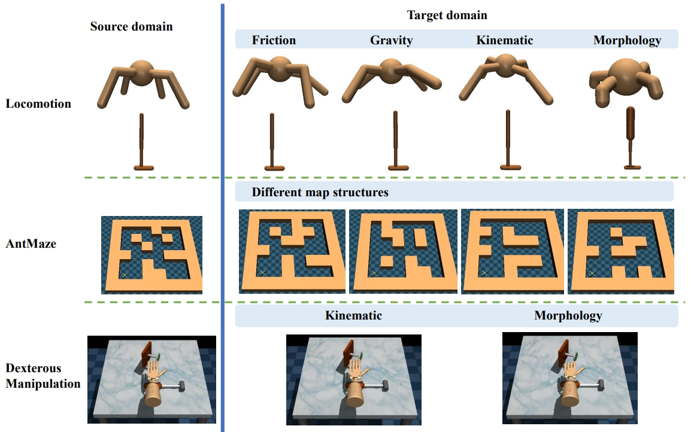

# ODRL - A Benchmark for Off-Dynamics Reinforcement Learning

**ODRL** is a benchmark for off-dynamics RL. ODRL notably define the problem setting of off-dynamics RL as follows:

*The agent has access to sufficient data from the source domain and a limited budget of data from the target domain, where there exist dynamics shifts between these domains. The agent aims at getting better performance in the target domain by leveraging data from both domains.*

We give an overview of our benchmark below.

## Connections and Comparison of ODRL Against Other Benchmarks

ODRL is related to numerous transfer RL/multi-task RL benchmarks. We include a comparison of ODRL against some commonly used benchmarks below, including [D4RL](https://github.com/Farama-Foundation/D4RL), [DMC suite](https://github.com/google-deepmind/dm_control), [Meta-World](https://github.com/Farama-Foundation/Metaworld), [RLBench](https://github.com/stepjam/RLBench), [CARL](https://github.com/automl/CARL), [Gym-extensions](https://github.com/Breakend/gym-extensions/), [Continual World](https://github.com/awarelab/continual_world). 

| Benchmark | Offline datasets | Diverse Domains | Multi-task | Single-task Dynamics Shift |
| ----    | :---: | :---: | :---: | :---: |
| D4RL            | ✅ | ✅ | ❎ | ❎ |
| DMC suite       | ❎ | ✅ | ❎ | ❎ |
| Meta-World      | ❎ | ❎ | ✅ | ❎ |
| RLBench         | ✅ | ❎ | ✅ | ❎ |
| CARL            | ❎ | ✅ | ❎ | ✅ |
| Gym-extensions  | ❎ | ❎ | ✅ | ✅ |
| Continual World | ❎ | ❎ | ✅ | ❎ |
| **ODRL**        | ✅ | ✅ | ❎ | ✅ | 

## What are the key features of ODRL?

- ODRL covers a wide spectrum of dynamics shift task (friction shift, gravity shift, kinematic shift, etc.).
- All ODRL tasks are adapted from some commonly used tasks (e.g., MuJoCo, Adroit), which should make it easier for newcomers to get familiar with the benchmark
- ODRL considers both slight dynamics shift and severe dynamics shift to comprehensively examine the dynamics adaptation ability of the agents under extreme or non-extreme cases (specified by shift level, e.g., the gravity in the target domain of ODRL can be 5 times that of the source domain). 
- ODRL covers varied experimental settings where the source domain and the target domain can be either online or offline, and we provide offline datasets with varied qualities for all benchmark tasks
- ODRL has an easy-to-read code style
- ODRL collects numerous off-dynamics RL algorithms that are implemented in a single-file manner with a unified code style
- ODRL would be actively maintained to include more real-world tasks and more recent off-dynamics RL algorithms.